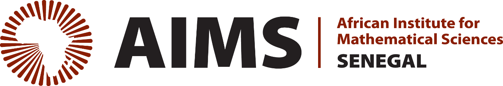

    
    

## <h2 align="center">                   `Python for Scientific Computing and Software Engineering`        </h2>

### <h3 align="center">                   `An initiation to programming using Python`        </h3>

This course seeks to teach you the basics of professional software development in the context of science. 
It is presented at the African Institute for Mathematical Sciences (AIMS), center of Senegal, 11th October 2021 to 29th October 2021.

The material is meant to be used on a university course (at any level where the material feels appropriate, depending on your background!), but can also be used for self-study. We concentrate on Python 3 only.

The team: 1 course – 4 centers-- Cameroon, Ghana, Senegal and South Africa. [`Official webpage for this course`](python.aims.ac.za)

Amazing ressources can also be find at: 

* [Dive into Python](http://www.diveintopython.net/toc/index.html);

* [Software Carpentry's Python Lectures](http://software-carpentry.org/4_0/python/);

* [IPython: A System for Interactive Scientific Computing](http://dx.doi.org/10.1109/MCSE.2007.53);

* [How to Think Like a Computer Scientist](http://www.greenteapress.com/thinkpython/thinkpython.html).

 ## The subjects we will cover include:

      * Basic Linux commands (The Shell - BASH), see this [repo](https://github.com/gabayae/friendly-shell-lesson);
      * Programming and Computer Science Basics - Python;
      * Version Control - git & gitHub.
    
 # Material Provenance
 The materials presented here come may have come originally from different sources, which include mainly
 
     -The Software Carpentry (swc-) lessons;
     -The Introduction to Programming using Python (IPuP) lessons developped in 2016, by:
          *Jeff Sanders; 
          *Yaé Ulrich Gaba; 
          *Jordan Masakuna;
      at the African Institute for Mathematical Sciences (AIMS), center of South Africa.
 
 
 # Asking Questions
 Please feel free to post questions (or point out mistakes) about the reading by opening a [GitHub issue](https://github.com/gabayae/scientific-computing/issues).
 
 # You want to Contribute?
 Contributions to this project are very welcome!Some great ways to help out are to:
 
          * proofread;
          * add reading comprehension exercises to existing sections;
          * provide general feedback about the organization of the website, the consistency material, etc. ;
       
You can either open an issue to provide feedback or point out errors, or you can create [pull request](https://help.github.com/en/articles/creating-a-pull-request).    
 
 
 # Additionnal Material
 I have not included it in the material but [here](https://github.com/adam-p/markdown-here/wiki/Markdown-Cheatsheet) is a nice Markdown "cheat sheet" for looking up how to make tables, code-blocks, etc., in Markdown. A [Jupyter Notebook for Beginners: A Tutorial](https://www.dataquest.io/blog/jupyter-notebook-tutorial/) is also available. 
 
 ## Note pour les francophones
 Pour les francophones, les sites web [`In2Py`](https://gabayae.github.io/bases_de_programmation_python/) et [`Atelier-3P`](https://ai-technipreneurs.github.io/site-officiel-atelier-3-P/) peuvent être utiles.

 
 
 
 
 # Making a Pull Request
 If you want to submit a change to some of the content (e.g. correcting typos), do the following:
 
   1. Clone this repository;
      
   2. Create a new branch, appropriately named for whatever task you are performing: 
       ``git checkout -b your_branch_name``;
   
   3. Check out your new branch and commit any changes you make to it;
      
   4. Push your branch: ``git push origin your_branch_name`` (you should have permission to do this, if you are added as a "contributor" to this project);
      
   5. Create a [Pull Request](https://help.github.com/en/articles/creating-a-pull-request) from your branch into the master branch.
 
 
#### Instructor: [Yaé Ulrich Gaba](https://github.com/gabayae).

